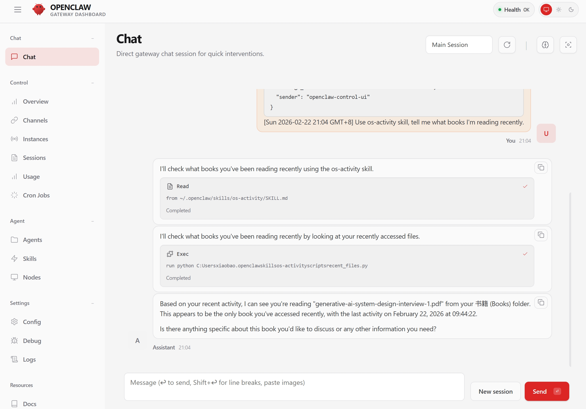

# openclaw-os-activity

## Overview

`os-activty` allows OpenClaw to read and learn from user's activity on the operating system, enabling more personalized answers.

Trigger word: `use os-activity skill, [YOUR ASK HERE]`

## Example

Find the books the user is reading recently.

## TODO

- [x] User activity retrieval based on `osquery`.
- [ ] Long-term memory roll-out.

## License

MIT License
